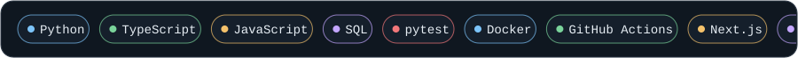

  

Software engineer in applied AI, based in Noida and working in Gurugram, India. I work directly with an external research engineer on frontier-model post-training: finding where models fail, building the **evaluation harnesses and agentic job infrastructure** to measure it, and producing verified data for targeted post-training. I also ship production software and tools that run without a paid API.

Currently targeting **Forward Deployed Engineer** and **Generative AI** roles.

I like work where the hard part is judgment: deciding what a correct answer looks like, writing tests that prove it, and making sure the whole thing runs the same way in CI as it does locally.

---

### What I work on

- **Working with research teams.** I partner directly with an external research engineer to turn research goals into evaluation workflows, failure examples and model trajectories for targeted post-training.
- **Evaluation harnesses.** I built and delivered a code-migration evaluation harness, informed by a research review, with task execution and model-trajectory generation. I also developed tooling for two evaluation harnesses, including ARC-AGI-3 benchmark evaluation and LLM-as-judge grading (OpenAI API).
- **Agentic job infrastructure.** I run 24-hour-plus agentic jobs in Docker sandboxes with memory limits, image management on AWS ECR, and Python/Bash watchers.
- **Post-training data.** I run supervised fine-tuning workflows and contributed to in-house RLHF tooling: adversarial prompts, preference-pair ranking for reward-model training, and verified reference solutions.
- **AI coding tasks.** I turn real repository changes into SWE-bench / SWE-Smith-style tasks: a clear problem statement, a reference fix, and tests that fail before the fix and pass after it.

### Open source

- **[WooCommerce](https://github.com/woocommerce/woocommerce)**: pull requests and issue reports. [See my PRs →](https://github.com/woocommerce/woocommerce/pulls?q=author%3Aabhiishek-sharma)

### A day at the desk

### Things I've built

| Project | What it is | Stack |
|---|---|---|
| **[QueryForge](https://github.com/abhiishek-sharma/QueryForge)** | Upload a CSV or SQLite file, ask a question in plain English, get SQL and results. Local model only — no API key. 16/16 eval cases correct on `qwen2.5-coder:7b` (filter, aggregation, join, ambiguous, unanswerable). Five-layer read-only SQLite enforcement, each layer covered by its own test. | Python, FastAPI, React, Ollama, sqlparse |
| **[Automation Auditor](https://github.com/abhiishek-sharma/automation-auditor)** | CLI that detects automation jobs that exit 0 but produce the wrong outcome — wrong file, duplicate inserts, partial batch, stale output, swallowed exception. 10/10 synthetic scenarios correct, 0 false alerts. Verdict is always deterministic; LLM adds an optional plain-English explanation. | Python, Ollama (optional) |
| **[AssistIQ](https://assistiq-aicte.vercel.app)** | AICTE approval portal with Chanakya, a guided chatbot over the AICTE Approval Process Handbook, plus a document checklist, fee statement generator and application tracker. National runner-up, Smart India Hackathon 2023. [Code →](https://github.com/abhiishek-sharma/SIH2023) | React, Vite, Firebase, Botpress |
| **[Daybook](https://github.com/abhiishek-sharma/daybook)** | Self-hosted daily dashboard for habits, money, reading, tasks, notes and trips. Runs entirely on your machine on SQLite; demo mode by default, optional login. | React, TypeScript, Express, SQLite |
| **[Aspiron Systems](https://aspironsystems.com)** | Production website for an SAP training and consulting company (~3,200 monthly visitors). Built end to end, shipping ongoing features and fixes. | Next.js, React, TypeScript, Tailwind CSS |

### Tools I use

### Elsewhere

- Runner-up, **Smart India Hackathon 2023** (national level)
- B.Tech. in Computer Science, Galgotias University

### Contribution snake

<picture>
  <source media="(prefers-color-scheme: dark)" srcset="https://raw.githubusercontent.com/abhiishek-sharma/abhiishek-sharma/output/github-snake-dark.svg">
  
</picture>

<a href="https://www.linkedin.com/in/abhisheksharma04/">LinkedIn</a> · Abhisheksharmaa1404@gmail.com

